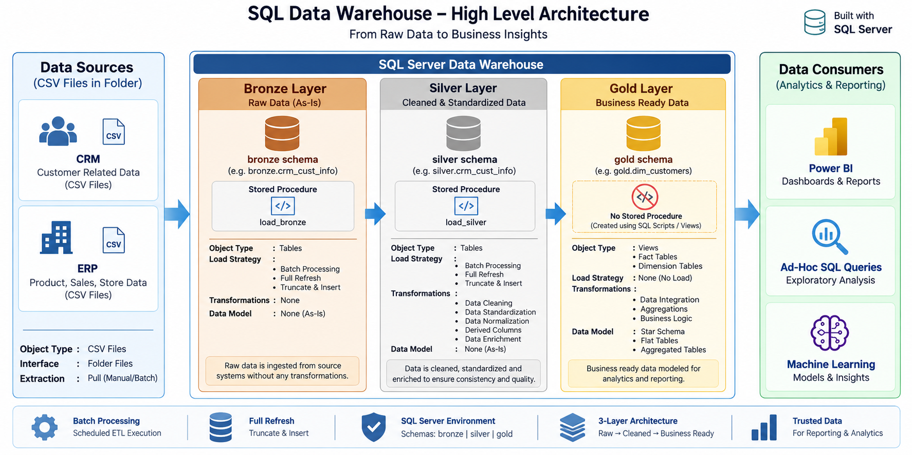

# SQL Data Warehouse Project

A SQL Server data warehouse project that transforms raw CRM and ERP CSV files into business-ready data for analytics and reporting.

## Project Overview

This project implements a three-layer data warehouse architecture:

```text
CRM & ERP CSV Files
        ↓
Bronze Layer
        ↓
Silver Layer
        ↓
Gold Layer
        ↓
Power BI | Ad-hoc SQL Queries | Machine Learning
```

## High-Level Architecture



## Data Sources

- **CRM:** Customer, product, and sales data
- **ERP:** Customer, product, and reference data
- **Interface:** CSV files stored in folders
- **Processing:** Batch processing

## Data Warehouse Layers

### Bronze Layer — Raw Data

Stores source data as-is.

- **Load:** Batch processing
- **Strategy:** Full load / full refresh
- **Method:** Truncate and insert
- **Transformations:** None
- **Data model:** None (as-is)
- **Implementation:** SQL Server tables and stored procedure

### Silver Layer — Cleaned & Standardized Data

Improves data quality and prepares data for business modeling.

- **Load:** Batch processing
- **Strategy:** Full load / full refresh
- **Method:** Truncate and insert
- **Transformations:**
  - Data cleaning
  - Data standardization
  - Data normalization
  - Derived columns
  - Data enrichment
- **Data model:** None (as-is)
- **Implementation:** SQL Server tables and stored procedure

### Gold Layer — Business-Ready Data

Integrates and transforms Silver data into analytical structures.

- **Load:** No separate raw-data load
- **Transformations:**
  - Data integration
  - Aggregations
  - Business logic
- **Data models:**
  - Star schema
  - Flat tables
  - Aggregated tables
- **Implementation:** SQL Server views and analytical tables

## Loading Strategy

The project uses **batch processing with a full-refresh approach**.

```text
Batch Processing
        ↓
Full Load
        ↓
TRUNCATE TABLE
        ↓
INSERT All Records
```

## Data Modeling

The Gold layer uses dimensional modeling.

### Dimension Tables

Store descriptive business information.

Examples:

- `gold.dim_customers`
- `gold.dim_products`

### Fact Tables

Store measurable business events.

Example:

- `gold.fact_sales`

### Surrogate Keys

Warehouse-generated keys used to identify dimension records.

```text
customer_key → Surrogate key
customer_id  → Source business key
```

## Project Structure

```text
sql-data-warehouse-project/
│
├── datasets/
│   ├── source_crm/
│   └── source_erp/
│
├── docs/
│   └── high_level_architecture.png
│
├── scripts/
│   ├── bronze/
│   ├── silver/
│   └── gold/
│
├── tests/
│
└── README.md
```

## Data Quality Checks

- Duplicate records
- Null values
- Invalid dates
- Incorrect data types
- Invalid relationships
- Unmatched foreign keys
- Invalid sales values
- Inconsistent categorical values

## Technologies Used

- SQL Server
- T-SQL
- SQL Server Management Studio
- Stored Procedures
- Views
- Dimensional Modeling
- Power BI
- GitHub

## Consumers

- **Power BI** — Dashboards and reporting
- **Ad-hoc SQL Queries** — Exploratory analysis
- **Machine Learning** — Analytical workflows

## Key Learning Outcomes

- Build a SQL Server data warehouse
- Implement Bronze, Silver, and Gold layers
- Load CSV files using batch processing
- Apply full-refresh ETL
- Clean and standardize data
- Create fact and dimension tables
- Generate surrogate keys
- Perform data quality validation
- Prepare data for Power BI

## License

This project is intended for learning, portfolio development, and interview preparation.
